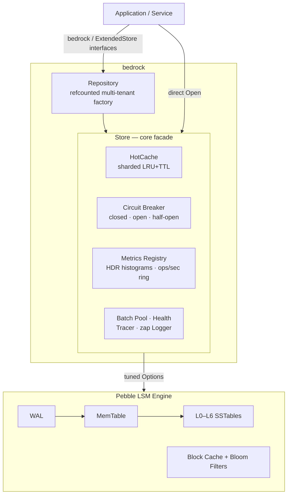

<div align="center">

# bedrock

**v1.0.0** — A production-grade, high-performance key-value store for Go, powered by CockroachDB's [Pebble](https://github.com/cockroachdb/pebble) LSM engine.

[](https://go.dev)
[](#testing--quality-gates)
[](#testing--quality-gates)
[](#testing--quality-gates)
[](#testing--quality-gates)
[](https://goreportcard.com)
[](#performance-characteristics)
[](#performance-characteristics)
[](https://github.com/cockroachdb/pebble)
[](#requirements)
[](#license)

</div>

---

## Table of Contents

- [Overview](#overview)
- [Architecture & Design](#architecture--design)
- [Features in Detail](#features-in-detail)
- [Quick Start](#quick-start)
- [Configuration Reference](#configuration-reference)
- [Observability Reference](#observability-reference)
- [Backup & Recovery](#backup--recovery)
- [Error Handling](#error-handling)
- [Testing & Quality Gates](#testing--quality-gates)
- [Documentation](#documentation)
- [Requirements](#requirements)
- [Contributing](#contributing)
- [License](#license)

## Overview

`bedrock` packages [CockroachDB's Pebble](https://github.com/cockroachdb/pebble) — the LSM storage engine that powers CockroachDB — as a reusable Go module with the operational features that production services need on day one: multi-instance management, an application-level hot cache, Prometheus metrics, circuit breaking, health checks, and crash-consistent backups.

Pebble is powerful but low-level. Engine lifecycle, block-cache reference counting, iterator bounds, WAL sync semantics, batch pooling, and LSM health are all caller responsibilities. `bedrock` encodes those responsibilities once, correctly, and adds an opinionated production layer on top — so your service gets a durable, observable, battle-tested key-value store behind a clean, small API with **only two direct dependencies** (`cockroachdb/pebble` and `go.uber.org/zap`).

### ✨ Key Features

- ⚡ **High performance** — hot-cache read p50 at **168 ns**, disk-backed read p99 at **6.9 µs**, fsync'd write p99 at **7.9 µs**, mixed throughput up to **1.2 M ops/s**
- 🧊 **Sharded LRU+TTL hot cache** — FNV-1a-striped, allocation-free lookups, write-coherent (read-your-writes), background janitor, per-entry TTL overrides
- 🔒 **Atomic batches** — all-or-nothing writes with pooled `*pebble.Batch` recycling (`sync.Pool`), including `DeleteRange` and `Merge`
- 📊 **Zero-dependency Prometheus metrics** — lock-free HDR-style latency histograms (p50–p99.9), ops/sec windows, cache statistics, and a curated set of Pebble engine gauges, exposed in text exposition format
- 🔌 **Circuit breaker** — classic closed/open/half-open state machine wired into the error taxonomy; expected outcomes (`ErrNotFound`) never count as failures
- 🩺 **Health checks** — Kubernetes-ready liveness/readiness probes with real read-path verification and engine-pressure detection (L0 files, compaction debt, memtable fill)
- 💾 **Checkpoint backup & recovery** — O(SSTables), crash-consistent snapshots; automated `OpenOrRestore` crash-recovery playbook
- 🏢 **Multi-tenant `Repository`** — named, reference-counted, path-safe store instances with graceful `CloseAll`
- 🧵 **Graceful shutdown** — atomic drain (`closing` flag + in-flight `WaitGroup`); no locks on the hot path, no torn shutdowns
- 🧭 **Structured logging & tracing** — `zap` integration with slow-operation warnings and an OTel-bridgeable `Tracer` interface with a zero-cost noop default
- 🛡️ **Error taxonomy** — sentinel errors (`ErrNotFound`, `ErrClosed`, …) with `Classify()` → `ok / transient / permanent` for retry policies and alerting
- 🌍 **Environment-based configuration** — 12-factor friendly `bedrock_*` variables that compose with functional options

### 🎯 Use Cases

**Reach for `bedrock` when you need:**

| Scenario | Why it fits |
|---|---|
| **Embedded persistence** for Go services | Durable LSM storage with WAL, no external database to operate |
| **Multi-tenant backends** | `Repository` gives per-tenant isolated engines with refcounted lifecycle |
| **High-read APIs with hot keyspaces** | The LRU+TTL hot cache turns microsecond reads into sub-microsecond hits |
| **Write-heavy ingestion pipelines** | Pooled atomic batches reach 1.8 M ops/s; WAL sync is a per-deployment knob |
| **Kubernetes-native workloads** | Built-in liveness/readiness semantics, Prometheus endpoint, resource-bounding options |
| **Systems needing auditable durability** | fsync-per-commit mode, crash-consistent checkpoints, WAL-recovery testing |

**Look elsewhere when you need:** SQL/secondary indexes, cross-process shared cache or replication (Pebble is single-writer per directory), or a distributed KV store — pair `bedrock` with your own coordination layer instead.

## Architecture & Design

### High-Level Architecture



### Request Flow

```
READ:   Get(key) ──► HotCache hit? ──yes──► return cached value (zero-copy, ~170ns)
                        │ no
                        ▼
                    Circuit check ──► Pebble Get ──► bloom filter ──► block cache / SST
                        ▲                                  │
                        └──────── single value copy ───────┘ (also fills hot cache)

WRITE:  Set/Batch ──► Circuit check ──► pooled pebble.Batch ──► WAL (fsync per policy)
                        │                                          │
                        └── cache update/invalidate AFTER commit ◄─┘ (read-your-writes)
```

### Core Components

| Component | Source | Responsibility |
|---|---|---|
| `Store` | `pebble_store.go` | Core facade implementing `bedrock` / `ExtendedStore`; lifecycle, drain-and-close, error mapping |
| `HotCache` | `cache.go` | Application-level read-through cache; FNV-1a sharding (8–64 stripes), intrusive LRU lists, TTL janitor, byte-budget enforcement |
| `MetricsRegistry` | `metrics.go`, `histogram.go`, `prometheus.go` | Lock-free counters, 512-bucket HDR-style histogram, 64-slot ops/sec ring, Prometheus text renderer |
| `CircuitBreaker` | `circuit.go` | Three-state breaker; failure accounting reuses the error taxonomy |
| `Repository` | `repository.go` | Named, refcounted, path-safe instance factory |
| `Iterator` | `iterator.go` | Snapshot-consistent range cursor with optional copy-ahead prefetch ring (up to 4096 entries) |
| `WriteBatch` | `batch.go` | Mutable, reusable, pooled atomic write buffer |
| Backup | `backup.go` | `CreateCheckpoint` / `RestoreCheckpoint` / `ListCheckpoints` / `OpenOrRestore` |
| Health | `health.go` | Liveness/readiness probes with a pure-function engine-pressure classifier |
| Errors | `errors.go` | Sentinel taxonomy + `Classify()` + `StoreError{Op, Key, Err}` wrapper |

### Design Decisions & Rationale

| Decision | Rationale |
|---|---|
| **Interface-first API** (`bedrock` → `ExtendedStore`) | A small core contract that is easy to mock; advanced features live on a superset interface so implementations stay honest |
| **Zero-copy read contract** | `Get`/iterator values are store-owned and read-only; the only mandatory allocation is a single value copy on cache miss — measured 16–192 B/op on hot paths |
| **App-level LRU+TTL in front of the block cache** | Block caches operate on compressed pages; caching *materialized values* for the hot set skips all engine machinery (~168 ns p50) |
| **Lock-free instrumentation** | Latency recording is `shift + mask + atomic add`; no mutex is touched by `Record`, so metrics never add contention to data paths |
| **Sentinel errors + `Classify()`** | Retry policies, breakers and alerts need *categories*, not strings; callers never import the engine to check `errors.Is` |
| **Prometheus text format, no client library** | The text exposition format is trivial to emit; this keeps the dependency tree at exactly two packages |
| **Pooled batches (`sync.Pool`)** | Encoding buffers are recycled with `Reset()`; 1000-op batches commit at 1.84 M ops/s with no per-batch allocation storm |
| **Graceful drain via `atomic.Bool` + `WaitGroup`** | `begin()` re-checks the closing flag around registration, closing the `Close` race without a hot-path mutex |
| **Engine tuning as defaults** | 32 KiB blocks + 256 KiB index blocks, Snappy compression, bloom filters (10 bits/key), L0 thresholds 4/8 — all override-able via options or env |

### Performance Characteristics

Measured on a disclosed 2-core Xeon / 4 GB CI sandbox (benchtime 1s, 100k keys × 100 B values). Full methodology and raw outputs: [docs/performance.md](docs/performance.md).

| Path | Latency | Throughput | Allocation |
|---|---|---|---|
| `Get` — hot-cache hit | **168 ns** p50 · 608 ns p99 | 1.37 M ops/s | 16 B · 1 alloc |
| `Get` — disk-backed (seq / random) | 1.1–1.6 µs p50 · **5.4–6.9 µs** p99 | 0.33–0.65 M ops/s | 192 B · 3 allocs |
| `Set` — WAL fsync per commit | 2.0 µs p50 · **7.9 µs** p99 | ~274 K ops/s | 22 B · 1 alloc |
| `Batch` — 1000 atomic ops | 543 µs / batch | **1.84 M ops/s** | pooled |
| `Scan` — 1000 keys (pass-through) | 61 µs / scan | 16.3 M keys/s | 136 B · 3 allocs |
| Mixed 95/5 — hot cache | 836 ns / op | **1.20 M ops/s** | 25 B · 1 alloc |

**GC posture:** hot paths allocate 16–192 B/op with ≤ 3 allocs; value copies are the only mandatory allocation. Absolute numbers scale with production hardware (dedicated NVMe, 8+ cores); the sandbox ceiling is scheduler contention at `GOMAXPROCS=2`, not the store.

## Features in Detail

### Core Operations

```go
ctx := context.Background()

// SET — durable per Config.SyncWrites (WAL fsync policy). Empty values are legal.
err := store.Set(ctx, []byte("user:42"), []byte(`{"name":"ada"}`))

// GET — returns (value, error). ErrNotFound is a normal, classified outcome.
val, err := store.Get(ctx, []byte("user:42"))
switch {
case errors.Is(err, bedrock.ErrNotFound): // miss
case err != nil:                               // engine failure (wrapped *StoreError)
default:                                       // hit — val is store-owned, READ-ONLY
}

// DELETE — idempotent; deleting a missing key succeeds.
err = store.Delete(ctx, []byte("user:42"))

// BATCH — atomic: every operation becomes visible together, or none does
// (crash-consistent via the Pebble WAL). Cache invalidation happens only
// after a successful commit.
err = store.Batch(ctx, []bedrock.Operation{
    {Type: bedrock.OpSet,        Key: []byte("acct:1"), Value: []byte("100")},
    {Type: bedrock.OpSet,        Key: []byte("acct:2"), Value: []byte("250")},
    {Type: bedrock.OpMerge,      Key: []byte("log:tx"), Value: []byte("transfer;")},
    {Type: bedrock.OpDeleteRange, Key: []byte("tmp/"),  End: []byte("tmp0")},
})
```

> **Value-lifetime contract:** values returned by `Get`/`Iterator` are store-owned and **read-only** — they remain valid until the next operation on the same key. This is what enables the zero-copy hot-cache path. Copy explicitly (`slices.Clone`) to retain.

### Range Scans & Iterators

```go
// Scan returns a snapshot-consistent iterator over the half-open range [start, end).
// nil bounds scan the whole keyspace. Iterators MUST be Closed.
it, err := store.Scan(ctx, []byte("acct:"), []byte("acct:~"))
if err != nil { return err }
defer it.Close()

for ; it.Valid(); it.Next() {
    fmt.Printf("%s = %s\n", it.Key(), it.Value()) // valid until next positioning call
}
if err := it.Error(); err != nil { return err }
```

The iterator supports `Next`, `Prev`, `SeekGE`, `SeekLT`, `First`, `Last`. Bounds are pushed down to Pebble (`LowerBound`/`UpperBound`), so table-level pruning applies. For bulk ETL scans, enable the copy-ahead prefetch ring:

```go
// ScanWithOptions is the extended variant on *Store (Scan delegates to it with zero options).
it, err := store.ScanWithOptions(ctx, start, end,
    bedrock.ScanOptions{Prefetch: 256}) // copies ahead; stable slices for the ring window
```

### Advanced Features

<details open>
<summary><b>🧊 Hot cache (LRU + TTL, write-coherent)</b></summary>

```go
store, _ := bedrock.Open(
    bedrock.WithDataDir(dir),
    bedrock.WithHotCache(64<<20, 5*time.Minute), // 64 MiB budget, 5 min default TTL
)
```

- **Sharding:** FNV-1a hash → `GOMAXPROCS*2` stripes (clamped 8–64); each stripe is a mutex + map + intrusive LRU list. Lookups use Go's allocation-free `m[string(bytes)]` idiom.
- **Memory accounting:** every entry charges `len(k)+len(v)+96`; eviction happens on insert/janitor — never on the read path.
- **Coherence:** `Set`/`Delete`/`DeleteRange`/`Batch` update or invalidate entries **only after a successful engine commit** → read-your-writes within the process.
- **TTL:** per-entry expiry with a janitor sweeping at `TTL/2`; `SetWithTTL` overrides per key.

```go
_ = store.SetWithTTL(ctx, sessionKey, blob, 30*time.Second) // pin in hot cache for 30s
entries, bytes := store.CacheStats()                          // occupancy gauge
```

</details>

<details>
<summary><b>📝 Streaming WriteBatch (pooled, reusable)</b></summary>

```go
wb := store.NewWriteBatch()
defer wb.Close() // always release pooled resources, even after Commit

for rec := range records {
    if err := wb.Set(rec.Key, rec.Val); err != nil { return err }
}
if err := wb.Commit(ctx); err != nil { return err } // atomic
wb.Reset() // reuse the same buffer for the next round
```

`Count()` reports queued operations; `Len()` the encoded size in bytes.

</details>

<details>
<summary><b>🧹 Maintenance (flush & compaction)</b></summary>

```go
_ = store.Flush(ctx)                                        // force memtable → SSTables
_ = store.CompactRange(ctx, []byte("acct:"), []byte("acct:~")) // nil/nil = whole keyspace
```

Compaction merges delete tombstones and reduces read amplification. `CompactRange(nil, nil)` derives bounds from the live keyspace automatically (Pebble requires `start < end`).

</details>

<details>
<summary><b>💾 Checkpoint backup & restore</b></summary>

```go
// Near-instant, crash-consistent hardlink snapshot (includes the WAL).
if err := store.CreateCheckpoint("/backups/kv-2026-09-10"); err != nil { ... }

// Materialize into a fresh directory ready for Open.
if err := bedrock.RestoreCheckpoint("/backups/kv-2026-09-10", "/var/lib/kv"); err != nil { ... }

// Automated crash playbook: try open → on unrecoverable failure restore backup → retry.
store, err := bedrock.OpenOrRestore(cfg, "/backups/kv-2026-09-10")
```

Non-empty destinations are refused (`ErrCheckpointExists`) to prevent accidental clobbering. See [Backup & Recovery](#backup--recovery).

</details>

### Production Features

#### 📊 Metrics

`MetricsSnapshot()` returns a consistent, copyable view — per-op counters (`ok` / `not_found` / `error`), HDR-style percentiles (p50/p95/p99/p99.9/max), 10-second ops/sec windows, cache hit ratio, circuit state, and engine statistics (block cache, memtable, WAL, compaction debt, L0 files, disk usage, open iterators):

```go
snap := store.MetricsSnapshot()
fmt.Printf("get p99=%v hit-ratio=%.2f compaction-debt=%d B\n",
    snap.Ops["get"].Latency.P99, snap.CacheHitRatio, snap.Engine.CompactionDebt)
```

`PrometheusMetrics()` renders the full set — module counters, per-op cumulative-bucket histograms (`le` from 1 µs → 10 s), cache gauges, breaker state, and mapped engine gauges — in text exposition format 0.0.4. Wire it with one route:

```go
http.HandleFunc("/metrics", func(w http.ResponseWriter, _ *http.Request) {
    io.WriteString(w, store.PrometheusMetrics())
})
```

The complete metric catalogue is in [Observability Reference](#observability-reference).

#### 📜 Logging & Tracing

Structured lifecycle and slow-operation events flow through `zap`; operations slower than `Config.SlowOpThreshold` (default 50 ms) emit warnings. A `Tracer` interface (noop by default) bridges to OpenTelemetry without a hard dependency, and `CtxFieldExtractor` lets you attach request/trace IDs from contexts to every log line:

```go
logger, _ := zap.NewProduction()
store, _ := bedrock.Open(
    bedrock.WithDataDir(dir),
    bedrock.WithZapLogger(logger),
    bedrock.WithSlowOpThreshold(25*time.Millisecond),
    bedrock.WithContextFields(func(ctx context.Context) []zap.Field {
        if id, ok := ctx.Value("request-id").(string); ok {
            return []zap.Field{zap.String("request_id", id)}
        }
        return nil
    }),
)
```

#### 🩺 Health Checks

`HealthCheck(ctx)` runs three probes — engine reachable, a real read against a reserved internal key, and engine-pressure evaluation (L0 ≥ 20 files, compaction debt ≥ 1 GiB, memtable ≥ 90 % of budget) — and returns structured status with Kubernetes helpers:

```go
http.HandleFunc("/healthz", func(w http.ResponseWriter, _ *http.Request) {
    h := store.HealthCheck(r.Context())
    if h.Alive() { w.WriteHeader(http.StatusOK) } else { w.WriteHeader(http.StatusServiceUnavailable) }
})
http.HandleFunc("/readyz", func(w http.ResponseWriter, _ *http.Request) {
    h := store.HealthCheck(r.Context())
    if h.Ready() { w.WriteHeader(http.StatusOK) } else { w.WriteHeader(http.StatusServiceUnavailable) }
})
```

- `Alive()` — liveness: only `unhealthy` fails (degraded stores stay alive).
- `Ready()` — readiness: only `healthy` receives traffic (degraded stores are drained first).

#### 🔌 Circuit Breaker

Classic three-state machine: **closed → open** at N failures within a sliding window → **half-open** after cooldown → **closed** after M consecutive probe successes. Defaults (50 failures / 30 s window / 5 s cooldown / 3 probes) apply to zero-valued fields. Failure accounting reuses the error taxonomy: `ErrNotFound` and other expected outcomes never count; state transitions bump `bedrock_circuit_opens_total` and emit warnings. While open, operations fail fast with `ErrCircuitOpen` (classified transient).

#### 🛡️ Error Taxonomy

Every engine failure is wrapped in `*StoreError{Op, Key, Err}` (unwraps via `errors.Is/As`) and mapped onto module sentinels — Pebble's own `ErrNotFound` never leaks into your error handling. `Classify(err)` sorts any error into `ok / transient / permanent` for retry policies and alerting. Full table in [Error Handling](#error-handling).

### Concurrency Model

- **All methods are safe for concurrent use** by multiple goroutines. Operations never spawn goroutines and never allocate beyond the returned value.
- **Lifecycle, not operations, is serialized:** a single `atomic.Bool` (`closing`) plus a `sync.WaitGroup` (`inFlight`) implement graceful shutdown. `begin()` re-checks the flag around registration, closing the race with `Close()` — no mutex on the hot path.
- **`Close()` is idempotent** (`sync.Once`): it flips `closing`, drains in-flight operations, stops the cache janitor, closes the engine, and unrefs the block cache. Post-close operations return `ErrShuttingDown` / `ErrClosed` (both transient).
- **Repository refcounting:** repeated `Open(name)` returns the same engine and bumps the count; `Close(name)` decrements, closing at zero; `CloseAll` drains every instance and aggregates errors.
- **Single-writer per directory:** Pebble guarantees durability per data directory; do not open two engines on the same path. Cross-process readers see committed state, but the hot cache is per-process — set the TTL no larger than your acceptable staleness window when writers are out-of-band.
- **Cache-shard locking:** the only data-path mutexes are per-shard hot-cache locks (8–64 stripes); engine-level concurrency is Pebble's own.

## Quick Start

### Installation

```bash
# Go 1.23+ required.
#
# The module ships as `bedrock`. Clone/copy this repository into your
# project (or a vendor dir) and wire it with a replace directive:
git clone github.com/Skryldev/bedrock
```

```go
import "github.com/Skryldev/bedrock"
```

### 60-Second Tour

```go
package main

import (
        "context"
        "errors"
        "fmt"
        "log"
        "time"

        "github.com/Skryldev/bedrock"
)

func main() {
        // Open with production defaults + a hot cache and a circuit breaker.
        store, err := bedrock.Open(
                bedrock.WithDataDir("/var/lib/myapp/kv"),
                bedrock.WithHotCache(64<<20, 5*time.Minute), // 64 MiB LRU+TTL read cache
                bedrock.WithCircuitBreaker(bedrock.CircuitConfig{}), // zero fields → defaults
        )
        if err != nil {
                log.Fatal(err)
        }
        defer store.Close() // drains in-flight ops, stops janitor, closes engine

        ctx := context.Background()

        // Basic CRUD.
        if err := store.Set(ctx, []byte("greeting"), []byte("hello")); err != nil {
                log.Fatal(err)
        }
        val, err := store.Get(ctx, []byte("greeting")) // hot-cache hit ≈ 170 ns p50
        switch {
        case errors.Is(err, bedrock.ErrNotFound): // miss — expected path
        case err != nil: // engine failure (wrapped *StoreError)
                log.Fatal(err)
        default:
                fmt.Println("greeting =", string(val))
        }

        // Atomic batch: all ops visible together, or none.
        err = store.Batch(ctx, []bedrock.Operation{
                {Type: bedrock.OpSet, Key: []byte("acct:1"), Value: []byte("100")},
                {Type: bedrock.OpSet, Key: []byte("acct:2"), Value: []byte("250")},
                {Type: bedrock.OpDeleteRange, Key: []byte("tmp/"), End: []byte("tmp0")},
        })
        if err != nil {
                log.Fatal(err)
        }

        // Range scan [start, end).
        it, err := store.Scan(ctx, []byte("acct:"), []byte("acct:~"))
        if err != nil {
                log.Fatal(err)
        }
        for ; it.Valid(); it.Next() {
                fmt.Println(it.Key(), it.Value())
        }
        it.Close()
}
```

A complete lifecycle tour (open → CRUD → batch → scan → metrics → checkpoint → graceful close) lives in [`cmd/server`](cmd/server/main.go):

```bash
go run ./cmd/server
```

### Configuration

**Functional options** (recommended) — every knob has a production default:

```go
store, err := bedrock.Open(
        bedrock.WithDataDir("/var/lib/myapp/kv"),
        bedrock.WithName("primary"),
        bedrock.WithCacheSizeMB(64),            // Pebble block cache
        bedrock.WithMemTableSizeMB(32),         // larger memtable = fewer, bigger SSTables
        bedrock.WithSyncWrites(true),           // fsync WAL per commit (strict durability)
        bedrock.WithBloomBitsPerKey(10),        // ≈1% false-positive reads
        bedrock.WithHotCache(64<<20, 5*time.Minute),
        bedrock.WithMaxBatchOps(10_000),        // reject oversized batches
        bedrock.WithZapLogger(logger),
        bedrock.WithSlowOpThreshold(25*time.Millisecond),
)
```

**Environment variables** (12-factor style) — compose with options; **options win**:

```bash
export BEDROCK_DATA_DIR=/var/lib/myapp/kv
export BEDROCK_CACHE_MB=64
export BEDROCK_SYNC_WRITES=true
export BEDROCK_HOTCACHE_MB=64
export BEDROCK_HOTCACHE_TTL_MS=300000
```

```go
store, err := bedrock.OpenFromEnv(
        bedrock.WithHotCache(64<<20, 5*time.Minute), // still overrides env
)
```

The full option and variable catalogue is in [Configuration Reference](#configuration-reference).

### Common Operations Cookbook

**Multi-tenant instances** (isolated engines, refcounted):

```go
repo := bedrock.NewRepository("/var/lib/tenants", bedrock.WithCacheSizeMB(64))

alpha, _ := repo.Open("alpha") // /var/lib/tenants/alpha
beta, _ := repo.Open("beta")   // /var/lib/tenants/beta — isolated engine
_ = repo.Close("alpha")        // refcount--; engine closes at zero
defer repo.CloseAll(ctx)       // graceful process shutdown
```

**Prometheus + Kubernetes wiring:**

```go
mux := http.NewServeMux()
mux.HandleFunc("/metrics", func(w http.ResponseWriter, _ *http.Request) {
        io.WriteString(w, store.PrometheusMetrics())
})
mux.HandleFunc("/healthz", func(w http.ResponseWriter, r *http.Request) {
        if store.HealthCheck(r.Context()).Alive() { w.WriteHeader(200) } else { w.WriteHeader(503) }
})
mux.HandleFunc("/readyz", func(w http.ResponseWriter, r *http.Request) {
        if store.HealthCheck(r.Context()).Ready() { w.WriteHeader(200) } else { w.WriteHeader(503) }
})
```

**Backup before maintenance:**

```go
stamp := time.Now().Format("20060102-150405")
if err := store.CreateCheckpoint("/backups/kv-" + stamp); err != nil { log.Fatal(err) }
backups, _ := bedrock.ListCheckpoints("/backups") // chronological by name
```

**TTL writes and merge:**

```go
_ = store.SetWithTTL(ctx, []byte("session:abc"), blob, 30*time.Second) // hot-cache pin
_ = store.Merge(ctx, []byte("counter:daily"), []byte("1;"))            // concat merge operator
```

## Configuration Reference

### Functional Options

| Option | Default | Description |
|---|---|---|
| `WithDataDir(dir)` | `./data/<name>` | Engine directory |
| `WithName(name)` | `default` | Logical instance name (metrics labels, logs, repo keys) |
| `WithCacheSizeMB(mb)` | `32` | Pebble block cache size |
| `WithMemTableSizeMB(mb)` | `16` | Memtable size (≥ 1) |
| `WithMemTableStopWritesThreshold(n)` | `4` | Queued memtables before write stall |
| `WithL0Thresholds(comp, files)` | `4` / `8` | L0→L1 compaction triggers |
| `WithMaxConcurrentCompactions(n)` | `2` | Parallel compaction bound |
| `WithMaxOpenFiles(n)` | `1024` | File-descriptor bound |
| `WithSyncWrites(v)` | `true` | fsync WAL per commit (durability knob) |
| `WithDisableWAL(v)` | `false` | Drop WAL entirely — **benchmarking only, data loss on crash** |
| `WithBloomBitsPerKey(bits)` | `10` | Bloom filter density (≈1 % FP) |
| `WithHotCache(maxBytes, ttl)` | disabled | Enable LRU+TTL cache (defaults when enabled: 64 MiB / 5 min) |
| `WithHotCacheConfig(cfg)` | — | Full hot-cache spec (`MaxBytes`, `Shards`, `TTL`, `JanitorInterval`) |
| `WithCircuitBreaker(cfg)` | disabled | Breaker; zero fields → 50 fail / 30 s / 5 s cooldown / 3 probes |
| `WithMaxBatchOps(n)` | `0` (unlimited) | Reject `Batch` calls with more ops |
| `WithZapLogger(l)` | nop logger | Structured lifecycle + slow-op logging |
| `WithTracer(t)` | `NoopTracer` | Operation spans (OTel-bridgeable) |
| `WithContextFields(fn)` | — | Extract log fields from contexts |
| `WithSlowOpThreshold(d)` | `50ms` | Warn threshold; negative disables |
| `WithEnvPrefix(p)` | `BEDROCK` | Prefix consumed by `ApplyEnv` |

### Environment Variables

| Variable | Maps to | Format |
|---|---|---|
| `BEDROCK_NAME` | `WithName` | string |
| `BEDROCK_DATA_DIR` | `WithDataDir` | path |
| `BEDROCK_CACHE_MB` | `WithCacheSizeMB` | int |
| `BEDROCK_MEMTABLE_MB` | `WithMemTableSizeMB` | int |
| `BEDROCK_L0_COMPACTION_THRESHOLD` | `WithL0Thresholds` | int |
| `BEDROCK_MAX_OPEN_FILES` | `WithMaxOpenFiles` | int |
| `BEDROCK_BLOOM_BITS` | `WithBloomBitsPerKey` | int |
| `BEDROCK_MAX_BATCH_OPS` | `WithMaxBatchOps` | int |
| `BEDROCK_SYNC_WRITES` | `WithSyncWrites` | `true/false/1/0/yes/no/on/off` |
| `BEDROCK_DISABLE_WAL` | `WithDisableWAL` | boolean |
| `BEDROCK_HOTCACHE_ENABLED` | hot cache on/off | boolean |
| `BEDROCK_HOTCACHE_MB` | `WithHotCache` bytes | int (MiB) |
| `BEDROCK_HOTCACHE_TTL_MS` | `WithHotCache` TTL | int (ms) |
| `BEDROCK_CIRCUIT_ENABLED` | `WithCircuitBreaker` | boolean |
| `BEDROCK_SLOW_OP_MS` | `WithSlowOpThreshold` | int (ms) |

Unset variables are ignored; malformed values fail fast with `ErrInvalidConfig` naming the offending variables.

## Observability Reference

### `MetricsSnapshot()` Fields

| Group | Fields |
|---|---|
| Identity | `Name`, `Uptime` |
| Per-op (`Ops["get"\|"set"\|"delete"\|"batch"\|"scan"\|"merge"]`) | `OK`, `NotFound`, `Errors`, `OpsPerSec` (10 s window), `Latency{Count, Mean, P50, P95, P99, P999, Max}` |
| Hot cache | `CacheHits`, `CacheMisses`, `CacheEvictions`, `CacheHitRatio`, `CacheEntries`, `CacheBytes` |
| Resilience | `CircuitState` (`closed`/`half_open`/`open`), `CircuitOpens`, `SlowOps` |
| Totals | `BatchOpsTotal`, `ScanKeysTotal`, `BytesRead`, `BytesWritten` |
| Engine (`DBStats`) | block-cache hits/misses/size, memtable size/count, WAL files/size/bytes-written, flush & compaction counts, compaction debt, L0/L6 files, tombstones, disk size, open iterators |

### Prometheus Metrics

| Metric | Type | Description |
|---|---|---|
| `bedrock_operations_total{op,result}` | counter | Operations by kind and outcome |
| `bedrock_operation_duration_seconds_{bucket,sum,count}` | histogram | Per-op latency, `le` buckets 1 µs → 10 s |
| `bedrock_operations_per_second` | gauge | 10 s-window rate per op |
| `bedrock_cache_{hits,misses,evictions}_total` | counter | Hot-cache activity |
| `bedrock_cache_{entries,bytes,hit_ratio}` | gauge | Hot-cache occupancy |
| `bedrock_circuit_state` | gauge | 0=closed, 1=half_open, 2=open |
| `bedrock_circuit_opens_total` | counter | Breaker trips |
| `bedrock_{batch_ops,scan_keys,slow_ops}_total` | counter | Workload totals |
| `bedrock_bytes_{read,written}_total` | counter | Application bytes |
| `bedrock_engine_*` | mixed | `block_cache_{hits,misses}_total`, `block_cache_size_bytes`, `memtable_{size_bytes,count}`, `wal_{files,size_bytes,bytes_written_total}`, `flushes_total`, `compactions_total`, `compaction_debt_bytes`, `l0_files`, `disk_size_bytes`, `open_iterators` |
| `bedrock_uptime_seconds` | gauge | Time since open |

### Recommended Alerts

| Alert | Expression sketch |
|---|---|
| Hot-cache efficiency collapsed | `rate(bedrock_cache_misses_total[5m]) > 3 × rate(hits)` with warm cache enabled |
| Write amplification / LSM pressure | `bedrock_engine_l0_files > 20` or `compaction_debt_bytes > 1 GiB` for 10 m |
| Breaker tripping | `increase(bedrock_circuit_opens_total[5m]) > 0` |
| Slow operations | `rate(bedrock_slow_ops_total[5m]) > 0` |
| Iterator leak | `bedrock_engine_open_iterators` trending up and never returning to ~0 |

## Backup & Recovery

Checkpoints use Pebble's hardlink-based snapshot: **O(number of SSTables)** — near-instant and independent of data size — and crash-consistent, including the WAL state at call time.

| API | Purpose |
|---|---|
| `store.CreateCheckpoint(destDir)` | Write a snapshot. Destination must not exist (or must be an empty dir); refuses otherwise with `ErrCheckpointExists`. |
| `bedrock.RestoreCheckpoint(backupDir, destDir)` | Materialize hardlinks into a fresh directory ready for `Open`. Restore to local NVMe for best open performance. |
| `bedrock.ListCheckpoints(root)` | Discover checkpoint directories (detected by their `MANIFEST-*`), sorted chronologically when named with timestamps. |
| `bedrock.OpenOrRestore(cfg, backupDir)` | Automated crash playbook: try `Open` → on failure with a backup present, wipe the damaged dir, restore, retry. |

Recommended cadence: checkpoint before version upgrades or maintenance windows; ship checkpoints to object storage (tar the directory — hardlinks materialize on copy); keep `OpenOrRestore` wired with the latest known-good backup for unattended crash recovery. Operational detail in [docs/deployment.md](docs/deployment.md).

## Error Handling

### Sentinel Errors

| Sentinel | Meaning | Class |
|---|---|---|
| `ErrNotFound` | Key absent (`Get`) — a normal outcome, never a failure | `ok` |
| `ErrEmptyKey` | Nil/zero-length key supplied | `ok` |
| `ErrCircuitOpen` | Breaker is shedding load | `transient` |
| `ErrShuttingDown` | Store draining; new work rejected | `transient` |
| `ErrClosed` | Store already closed | `transient` |
| `ErrEmptyBatch` | `Batch` with zero operations | `transient` |
| `ErrTooManyOps` | Batch exceeds `Config.MaxBatchOps` | `transient` |
| `ErrInvalidOperation` | Unknown op type or missing fields | `permanent` |
| `ErrCheckpointExists` | Snapshot destination occupied | `transient` |
| `ErrInvalidConfig` | Configuration out of range | `permanent` |
| `ErrStoreNotFound` | Repository lookup of unknown name | `transient` |
| `ErrRepositoryClosing` | Open during repository shutdown | `transient` |

### Usage

```go
val, err := store.Get(ctx, key)
if errors.Is(err, bedrock.ErrNotFound) {
        // miss — expected path
}

var serr *bedrock.StoreError
if errors.As(err, &serr) {
        log.Printf("op=%s key=%q class=%s cause=%v", serr.Op, serr.Key, serr.Classify(), serr.Err)
}
```

`Classify(err)` returns `ClassOK` / `ClassTransient` / `ClassPermanent` for *any* error (including wrapped engine and corruption errors), making it the single decision point for retry loops, the built-in breaker, and alert routing. Engine corruption (`pebble.ErrCorruption`), invalid configuration, and invalid operations classify as permanent — everything else as transient unless listed above.

## Testing & Quality Gates

All gates below were measured green on the shipped version:

| Gate | Command | Result |
|---|---|---|
| Build + vet | `make build vet` | ✅ clean |
| Unit + integration tests | `make test` | ✅ pass |
| Race detector (all packages) | `make test-race` | ✅ clean |
| Coverage gate (≥ 90 %) | `make cover-check` | ✅ **90.2 %** statements |
| Model-based fuzzing | `make fuzz` | ✅ 16,661 execs, zero failures |
| Benchmarks | `make bench` / `make bench-short` | ✅ results below |

The fuzz harness maintains an exact in-memory model and asserts store-vs-model equivalence on every observation — including range deletions and a final full-keyspace scan — across `set`/`get`/`delete`/`batch`/`scan`/`repair` sequences. Integration tests cover WAL-replay crash simulation, concurrent soak, multi-tenant repositories, and checkpoint roundtrips. Strategy details: [docs/testing.md](docs/testing.md).

### Benchmark Summary

```text
BenchmarkGet/hit_hotcache              733 ns/op     1.37 M ops/s    16 B/op   1 alloc
BenchmarkGet/miss_no_cache           3063 ns/op     0.33 M ops/s   192 B/op   3 allocs
BenchmarkSet/sync                    3658 ns/op                     22 B/op   1 alloc
BenchmarkBatchSet/size_1000        543164 ns/op     1.84 M ops/s
BenchmarkScan/keys_1000             61217 ns/op    16.34 M keys/s
BenchmarkMixedWorkload/95_5_hotcache  836 ns/op     1.20 M ops/s    25 B/op   1 alloc
```

2-core Xeon / 4 GB sandbox, benchtime 1s — full tables, latency percentiles, methodology, and the tuning guide are in [docs/performance.md](docs/performance.md), with raw outputs at [docs/benchmarks-raw-2026-09-10.txt](docs/benchmarks-raw-2026-09-10.txt) and [docs/latency-profile-raw-2026-09-10.txt](docs/latency-profile-raw-2026-09-10.txt).

## Documentation

| Document | Contents |
|---|---|
| [docs/architecture.md](docs/architecture.md) | Layered view, component design, concurrency core, memory strategy, consistency notes |
| [docs/performance.md](docs/performance.md) | Methodology, results, targets-vs-measured, techniques, tuning guide |
| [docs/deployment.md](docs/deployment.md) | Filesystem layout, Kubernetes, backups, monitoring & alerting |
| [docs/testing.md](docs/testing.md) | Test suites, coverage, fuzzing, race detection |
| [`cmd/server`](cmd/server/main.go) | Runnable end-to-end lifecycle demo |

## Requirements

- **Go 1.23+**
- **Direct dependencies (2):** `github.com/cockroachdb/pebble v1.1.5` · `go.uber.org/zap v1.28.0` — nothing else
- **OS:** Linux/macOS (any OS Pebble supports)
- **Storage:** SSD recommended for durable paths; reserve RAM ≈ block cache + hot cache + memtables (defaults ≈ 60 MiB before workload)
- **Docker:** multi-stage, non-root image provided (`make docker-build`)

## Contributing

Issues and pull requests are welcome. Before submitting:

1. `make fmt && make vet` — formatting and static analysis must be clean.
2. `make test-race && make cover-check` — all tests pass under the race detector; coverage stays ≥ 90 %.
3. `make fuzz` — run at least 30 s of model-based fuzzing for behavioral changes.
4. Update [docs/](docs/) when changing behavior that is documented there (metrics, config, guarantees).

## License

[MIT](LICENSE) — free to use, modify, and distribute in open-source and commercial projects. Pebble and zap remain under their respective upstream licenses.